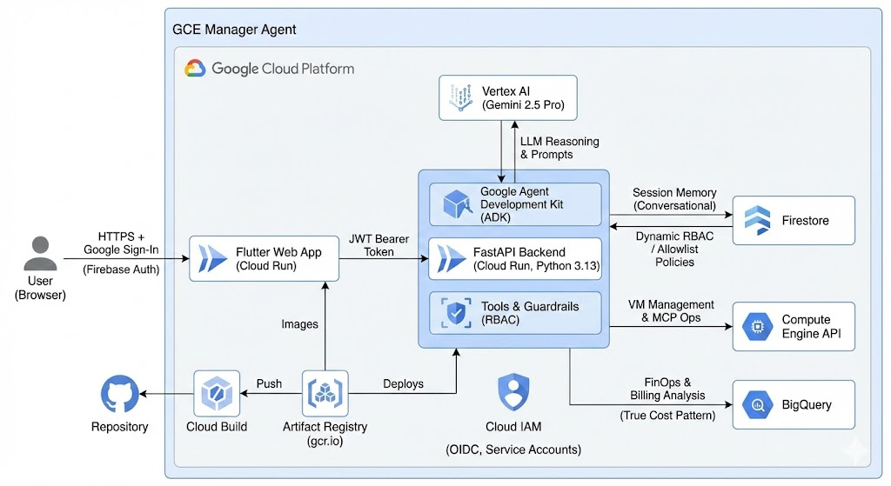

# GCE Manager Agent 🤖☁️

A secure, **Multi-Agent System** for managing Google Compute Engine infrastructure using natural language. Built with the **Google Agent Development Kit (ADK)**, powered by **Gemini 2.5 Pro**, and deployed on **Cloud Run** with a modern **Flutter Web** interface.

 
*(Example UI style - Material 3)*

## 🚀 Key Features

- **Natural Language DevOps**: "Start the development instance", "List all running servers", "Why is my bill so high?".
- **Multi-Project Management**: Seamlessly manage instances across multiple Google Cloud projects.
- **FinOps & Cost Intelligence**: Real-time "True Cost" calculation (including attached disks) and Savings recommendations.
- **Detailed SKU Audits**: Deep dive into billing SKUs with Uptime tracking and hardware specifications.
- **Secure Public Access**: Accessible from anywhere (no VPN required) via **Zero Trust** security.
- **Dynamic Access Control**: Manage authorized users in real-time via **Firestore** (no redeployment needed).
- **Modern UI**: Responsive Flutter Web application with Markdown support for rich reports.

## 🏗️ Architecture

The system follows a split architecture deployed on **Google Cloud Run**:



- **Frontend**: Flutter Web (Material 3) served via Nginx container.
- **Backend**: Python 3.13 + FastAPI + ADK (`LlmAgent`).
- **Auth**: Google Sign-In (Firebase Authentication).
- **Authorization**: Custom middleware checking `allowed_users` collection in Firestore.

## 🛠️ Setup & Deployment

### Prerequisites (GCP Architect Guide)

#### 1. APIs to Enable
Ensure the following APIs are enabled in your project:
- **Compute Engine API** (`compute.googleapis.com`)
- **Cloud Run API** (`run.googleapis.com`)
- **Vertex AI API** (`aiplatform.googleapis.com`)
- **Cloud Build API** (`cloudbuild.googleapis.com`)
- **Firestore API** (`firestore.googleapis.com`)
- **BigQuery API** (`bigquery.googleapis.com`)
- **Recommender API** (`recommender.googleapis.com`)

#### 2. Service Account & IAM
Create a service account (default expected: `mcp-manager@YOUR_PROJECT.iam.gserviceaccount.com`) and grant:
- `roles/compute.admin`: Manage instances (Start/Stop/Create).
- `roles/aiplatform.user`: Access Gemini 2.5 Pro.
- `roles/datastore.user`: Application DB access (Firestore).
- `roles/bigquery.jobUser`: Execute cost analysis queries.
- `roles/recommender.viewer`: Fetch savings recommendations.

> **Note**: For FinOps features, grant `roles/bigquery.dataViewer` on the *Billing Data Dataset* specifically.

#### 3. FinOps Configuration
To enable **True Cost** and **Savings** reports:
1.  **Billing Export**: Enable "Detailed usage cost export" to BigQuery in the Billing Console.
2.  **Configuration**: Update `BILLING_TABLE_ID` in `billing.py` with your export table name.

#### 4. Critical Dependencies
- **GCloud CLI**: Installed and authenticated.
- **Firebase Project**: Linked for Authentication.

### 1. Configuration
This repository uses a **secure configuration pattern**. The Firebase config is **not** committed to the repo.

1.  Copy the example config:
    ```bash
    cp frontend/lib/firebase_config_example.dart frontend/lib/firebase_config.dart
    ```
2.  Edit `frontend/lib/firebase_config.dart` with your actual Firebase values.

### 2. Firestore Access Control
To authorize a user, create a document in your **Firestore Database**:
- **Collection**: `allowed_users`
- **Document ID**: `email@domain.com` (The user's Google Email)
- **Field**: `active` (boolean: `true`)

### 3. Deploy
Run the automated deployment script. It handles building containers, submitting to Artifact Registry, and deploying strict IAM policies.

```bash
./deploy.sh
```

*(Note: The script automatically handles `repo-to-cloudbuild` secret transfer via `.gcloudignore` whitelisting)*.

## 🔐 Security Model

This project uses a **Defense-in-Depth** strategy:
1.  **Identity**: Authenticated via Google (Firebase Auth).
2.  **Authorization**: Token verification on every Backend request. Checks dynamic Firestore allowlist.
3.  **Infrastructure**: Hosted on managed Serverless infrastructure (Cloud Run).
4.  **Secrets**: No keys in the repository. Configs are injected at build time.

## 🧩 Tech Stack
- **AI Model**: Gemini 2.5 Pro
- **Framework**: Google ADK (Agent Development Kit)
- **Frontend**: Flutter 3.x (Web)
- **Backend**: FastAPI (Python)
- **Database**: Firestore (NoSQL)
- **Infrastructure**: Cloud Run + Cloud Build

## 📄 License
MIT
